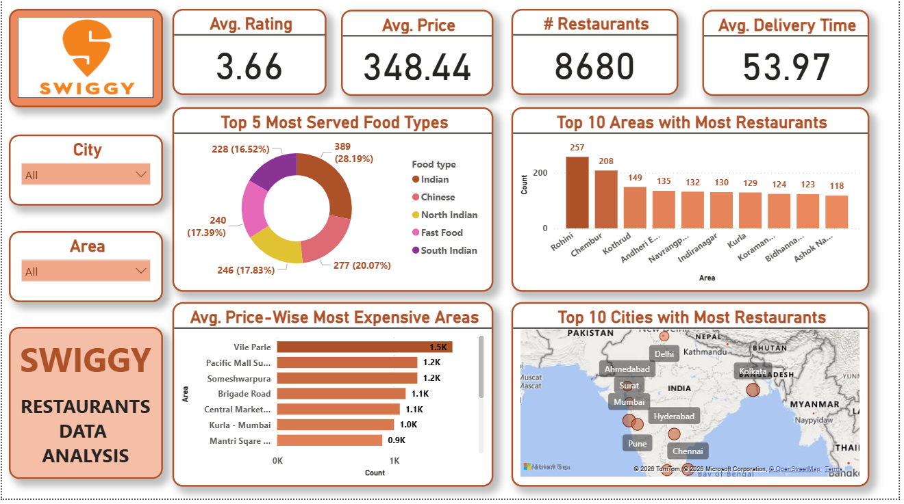

# Swiggy-Restaurant-Data-Analysis-PowerBI
Here is a short, punchy description for your project:  > An interactive Power BI dashboard analyzing **8,680 Swiggy restaurant listings** across India to uncover key trends in pricing, user ratings, popular cuisines, and delivery performance.
# 🛵 Swiggy Restaurant Data Analysis & Dashboard

An end-to-end data analysis and Business Intelligence project exploring Swiggy restaurant listings, pricing trends, user ratings, delivery times, and geographical distribution across major Indian cities.

---

## 📊 Dashboard Preview


---

## 🚀 Project Overview
This project leverages data analytics to uncover insights into the Indian food delivery ecosystem using Swiggy restaurant data. The final output is an interactive Power BI dashboard designed to help stakeholders understand restaurant densities, pricing variations, popular cuisines, and delivery performance.

---

## 📈 Key Performance Indicators (KPIs)
* **Total Restaurants Analyzed:** 8,680
* **Average Rating:** 3.66 / 5.0
* **Average Price (for two):** ₹348.44
* **Average Delivery Time:** ~53.97 minutes

---

## 🔍 Key Insights & Findings
1. **Popular Cuisines:** Chinese, North Indian, and Fast Food dominate the market offerings across most metropolitan areas.
2. **High-Density Hubs:** Areas like *Rohini* and *Chembur* feature the highest concentration of listed restaurants.
3. **Premium Dining Locations:** Premium pricing clusters heavily in upscale commercial and residential hubs such as *Vile Parle*, *Brigade Road*, and *Punjabi Bagh*.
4. **Delivery Performance:** Delivery times average around 54 minutes, influenced by traffic density and geographic spread in major urban centers like Kolkata, Mumbai, and Bangalore.

---

## 🛠️ Tools & Technologies
* **Data Cleaning & Preparation:** Python (Pandas) / Excel
* **Data Visualization & BI:** Microsoft Power BI
* **Version Control:** Git & GitHub

---

## 📂 Repository Structure
```text
├── swiggy.csv                  # Cleaned dataset used for analysis
├── Swiggy Analysis Project.pbix # Power BI report file
├── Swiggy Analysis Project.jpg  # Dashboard preview image
└── README.md                    # Project documentation
